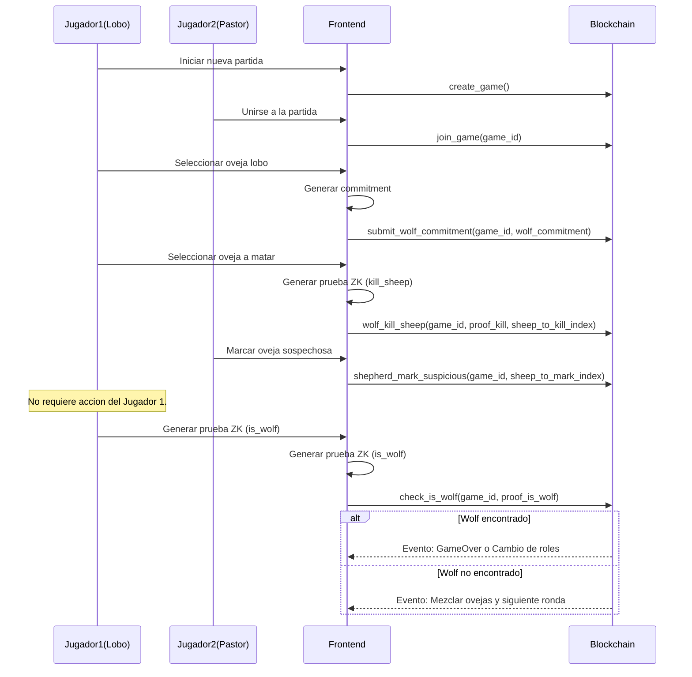

# Hunting the Wolf - ZK Game

A deduction game where a wolf hides among sheep and a shepherd tries to find it, using zero-knowledge proofs (ZK) to keep the wolf's identity hidden.

## Game Concept

Hunting the Wolf is a game where one player (the wolf) disguises as a sheep and another player (the shepherd) tries to find it among the other sheep. The game implements zero-knowledge proofs to keep the wolf's identity private, adding a layer of cryptographic security to the game.

### Game Mechanics

1. **Game Start**:
   - A board with 16 sheep is generated, each with an assigned number.
   - The wolf chooses a sheep to hide its identity and sends a cryptographic commitment that keeps its choice secret.

2. **Rounds**:
   - In each round, the wolf must select an adjacent sheep to kill, verified through ZK proofs.
   - The sheep appears dead on the board.
   - The shepherd marks a sheep as suspicious.
   - The wolf generates a ZK proof that verifies whether the marked sheep is the wolf or not, without revealing its identity.
   - If the marked sheep is the wolf, the round ends. If not, the sheep dies and the game continues.

3. **End**:
   - After 3 rounds, players swap roles (the shepherd becomes the wolf and vice versa).
   - The game ends after 6 total rounds (3 for each role).
   - The score is based on the number of sheep each player managed to eliminate.
   - The player with the highest score wins.

## Privacy System

The game implements two main ZK circuits:

1. **kill_sheep**: Verifies that:
   - The wolf is who it claims to be (matches the commitment)
   - The sheep to be killed is adjacent to the wolf (horizontally, vertically, or diagonally)
   - The sheep to be killed is alive

2. **is_wolf**: Verifies that:
   - The wolf's commitment is valid
   - The marked sheep is alive
   - Whether the marked sheep is the wolf or not

### Privacy Flow

1. **Wolf's initial commitment**:
   - The wolf chooses a sheep and generates a random value (salt) that is saved in localStorage
   - Creates a commitment using the Poseidon function: `poseidon([wolf_sheep_number, wolf_salt])`
   - Only this hash is published on the blockchain, keeping the wolf's identity secret

2. **Sheep's death**:
   - The wolf selects an adjacent sheep to kill
   - Generates a ZK proof with the `kill_sheep` circuit
   - The sheep dies and is saved in the contract

3. **Shepherd's selection of the suspicious sheep**:
   - The shepherd selects a suspicious sheep
   - This selection is saved in the contract

4. **The wolf generates a ZK proof to verify if the marked sheep is the wolf**:
   - The wolf's frontend is waiting for the shepherd to mark a sheep as suspicious
   - Generates a ZK proof with the `is_wolf` circuit
   - The ZK proof is sent to the contract

5. **Wolf verification**:
   - The contract verifies the ZK proof and determines the result
   - The result (1=is wolf, 0=is not wolf) is obtained without revealing the wolf's identity
   - Only if the wolf is found (result=1), the round ends
   - If the wolf is not found, the game is saved for the next round


# Example of the Game "Hunting the Wolf" on a 4x4 Board

In this example, we will illustrate the game on a 4x4 board with 16 sheep (numbered 1 to 16) to show the two main scenarios: when the shepherd does not find the wolf and when they finally find it.

### Initial Setup

**Wolf Location:**
I choose a specific sheep for the wolf to hide in. In this case, it hides in sheep 12 (fourth column, third row).

```
┌───┬───┬───┬───┐
│ 1 │ 2 │ 3 │ 4 │
├───┼───┼───┼───┤
│ 5 │ 6 │ 7 │ 8 │
├───┼───┼───┼───┤
│ 9 │10 │11 │12 │ ← (The wolf is here, but nobody knows except itself)
├───┼───┼───┼───┤
│13 │14 │15 │16 │
└───┴───┴───┴───┘
```

### Wolf's Turn
1. The wolf (hidden in sheep 12) decides to kill adjacent sheep 8.
2. The wolf generates a ZK proof that verifies:
   - That it is who it claims to be (matches the commitment)
   - That the sheep to be killed (8) is adjacent to it
   - That the sheep to be killed is alive

```
┌───┬───┬───┬───┐
│ 1 │ 2 │ 3 │ 4 │
├───┼───┼───┼───┤
│ 5 │ 6 │ 7 │ X │ ← (X = sheep 8 dead)
├───┼───┼───┼───┤
│ 9 │10 │11 │12 │ ← (The wolf is here in sheep 12)
├───┼───┼───┼───┤
│13 │14 │15 │16 │
└───┴───┴───┴───┘
```

### Shepherd's Turn
1. The shepherd observes that sheep 8 has been killed.
2. Reasoning: "The wolf must be adjacent to 8. It could be 3, 4, 7, 11, or 12."
3. The shepherd decides to mark sheep 4 as suspicious.

### Verification
1. The wolf generates a ZK proof of `is_wolf` that verifies if sheep 4 is the wolf.
2. The proof confirms that sheep 4 is NOT the wolf, without revealing where the wolf actually is.
3. Sheep 4 dies for being wrongly accused.

```
┌───┬───┬───┬───┐
│ 1 │ 2 │ 3 │ X │ ← (X = sheep 4 dead)
├───┼───┼───┼───┤
│ 5 │ 6 │ 7 │ X │ ← (X = sheep 8 dead)
├───┼───┼───┼───┤
│ 9 │10 │11 │12 │ ← (The wolf is here in sheep 12)
├───┼───┼───┼───┤
│13 │14 │15 │16 │
└───┴───┴───┴───┘
```

### Mixing Sheep Between Rounds

At the end of each round, all living sheep (not dead) change positions:

1. The living sheep (1, 2, 3, 5, 6, 7, 9, 10, 11, 12, 13, 14, 15, 16) are randomly mixed on the board.
2. The wolf maintains its identity but may now be in a new position.
3. This mixing adds complexity to the game and makes tracking the wolf more difficult.

After mixing, the board might look like this (where each number represents the sheep now occupying that position):

```
┌───┬───┬───┬───┐
│ 7 │ 2 │16 │ X │ ← (X = sheep 4 dead)
├───┼───┼───┼───┤
│ 1 │15 │ 6 │ X │ ← (X = sheep 8 dead)
├───┼───┼───┼───┤
│ 3 │11 │13 │10 │
├───┼───┼───┼───┤
│ 9 │ 5 │14 │12 │ ← (The wolf is here in sheep 12)
└───┴───┴───┴───┘
```

### Wolf's Turn
1. The wolf (hidden in sheep 12, now in the bottom right corner) decides to kill adjacent sheep 10 (located above it).
2. The wolf generates a ZK proof that verifies it can kill the sheep in that position.

```
┌───┬───┬───┬───┐
│ 7 │ 2 │16 │ X │
├───┼───┼───┼───┤
│ 1 │15 │ 6 │ X │
├───┼───┼───┼───┤
│ 3 │11 │13 │ X │ ← (X = sheep 10 dead)
├───┼───┼───┼───┤
│ 9 │ 5 │14 │12 │ ← (The wolf is here in sheep 12)
└───┴───┴───┴───┘
```

### Shepherd's Turn
1. The shepherd observes that sheep 10 has been killed.
2. Reasoning: "This sheep could only be attacked by sheep in adjacent positions. It could be 6, 13, 14, or 12."
3. After analyzing the pattern of deaths and movements, the shepherd decides to mark sheep 12 as suspicious.

### Verification
1. The wolf generates a ZK proof of `is_wolf` that verifies if the marked sheep is the wolf.
2. The proof confirms that the marked sheep IS the wolf.
3. The round ends with the shepherd having successfully found the wolf.

```
┌───┬───┬───┬───┐
│ 7 │ 2 │16 │ X │
├───┼───┼───┼───┤
│ 1 │15 │ 6 │ X │
├───┼───┼───┼───┤
│ 3 │11 │13 │ X │
├───┼───┼───┼───┤
│ 9 │ 5 │14 │ L │ ← (L = wolf found)
└───┴───┴───┴───┘
```

The round ends with the shepherd having successfully found the wolf.

When starting the next round, the wolf hides in a new sheep and the game continues.
Player 1 is the wolf during the first 3 turns, and player 2 is the shepherd.
In the next 3 turns, the roles are reversed.
The player who kills more sheep as the wolf wins.

# Game State Flow Diagram

This diagram shows the complete flow of the "Hunting the Wolf" game, including both frontend and blockchain interactions. The game progresses through several main states:

