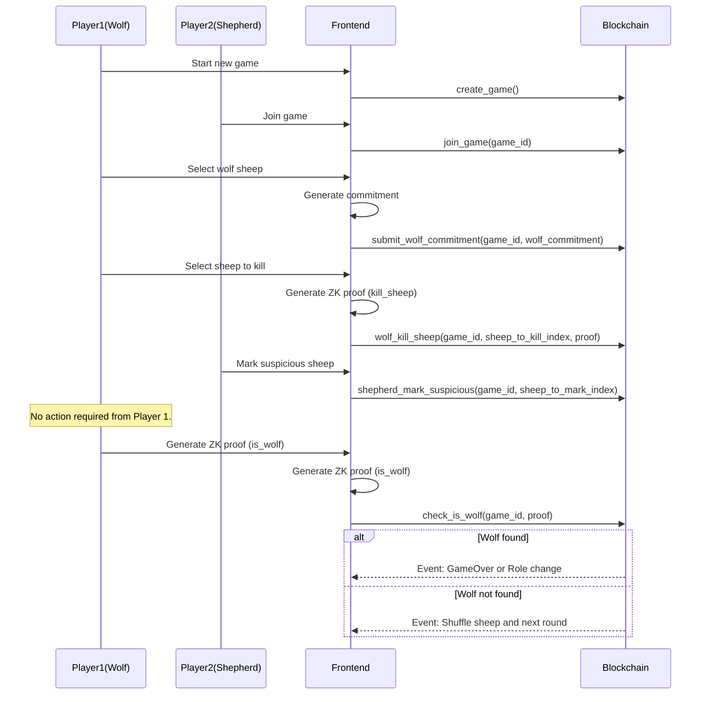

# Game State Flow Diagram

This diagram shows the complete flow of the "Hunting the Wolf" game, including both frontend and blockchain interactions. The game progresses through several main states:

